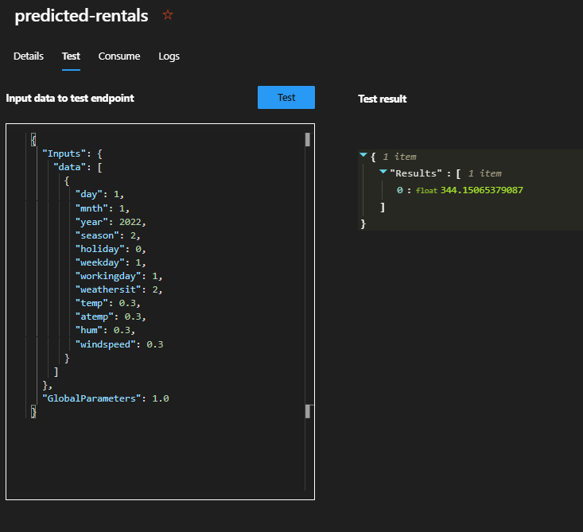

<h1 align ='center'> <strong>Machine Learning of Regression<strong> </h1>

Exprerimento realizado como desafio de aprendizagem no Bootcamp Microsoft Azure AI Fundamentals da [DIO](https://dio.me) seguindo a documentação oficial da Microsoft Azure Machine Learning AI900 Fundamentals nesse [link](https://microsoftlearning.github.io/AI-900-AIFundamentals/instructions/02-module-02.html).

## **Passo a passo**

- [1. Machine Learning Studio](#1-machine-learning-studio)
- [2. Espaço de Trabalho ](#2-create-workspace)
- [3. Automated ML](#3-automated-ml)
- [4. Task type & data](#4-task-type--data) 
- [5. Deploy ](#5-deploy)
- [6. Resumo](#6-resumo)

 

## **1. Machine Learning Studio**

- Primeiramente é necessário estar logado no Microsoft Azure. Se acaso ainda não tiver uma conta no Azure faça por esse [link](https://azure.microsoft.com/pt-br/free), clicando em "Experimente gratuitamente".

- Após o Login na barra de pesquisa, localizada na parte superior da página, pesquise por "Machine Learning" e selecione esta opção ou acesse esse [link](https://ml.azure.com/). 

 

[ Back to the top ](#passo-a-passo)

---

## **2. Espaço de Trabalho**
 
- Crie um novo espaço da trabalho clicando no botão "Create Workspace" em azul, localizado na parte superior direita da tela.

- Preencha as configurações conforme a imagem abaixo.

 

 

- Clique em "Create" e aguarde a finalização do processo.

- Após a finalização do processo clique no seu espaço de trabalho que encontra-se na seção "Recent Workspace".

 

[ Back to the top ](#passo-a-passo)
---

## **3. Automated ML**

- Após clicar em seu espaço de trabalho localize no menu latera esquerdo um a opção "Automated ML" e clique nela.

- Em seguida Clique no botão "+ New Automated ML jobs" e será redirecionado para o ambiente "Submit an Automated ML job".

- Preencha as configurações conforme a imagem abaixo.

 

 

- Clique em "Next". 

- Em "Select task type" selecione "Regression".

- Em "Select data" clique em "Create" e preencha as configurações conforme a imagem abaixo.

 

 

- Clique em "Next". 

- Em seguida na tela de "Data source" selecione a opção "From Web Files" e clique em "Next".

- Na tela "Web URL" insira o link - https://aka.ms/bike-rentals

- Clique em "Next". 

- Após a validação, em na tela "Settings" preencha as configurações como a imagem abaixo.

 

 

- Clique em "Next". 

- Na tela Schema inclua todas as opções exceto a opçãp "Path", como na imagem abaixo.

 

 

- Clique em "Next". 

- Revise se as configurações estão como na imagem abaixo.

 

 

- Clique em "Create" e aguarde a finalização do processo e que apareça a mensagem da imagem abaixo.

 

 

[ Back to the top ](#passo-a-passo)

---

## **4. Task type & data**

- Voltando a Tela de "Submit an Automated ML job" selecione a opção criada no passo anterior.

- Clique em "Next".

- Na tela Task Setttings selecione a Opção "rentals (Integer)" em "Target column".

- Clique na opão da engrenagem logo abaixo com a inscrição "View additional configuration settings".

- E realize a seguinte configuração.

 

 

- Clique em "Save". 

- Expanda a seção Limits e adicione a seguinte configuração.

 

 

- Clique em "Next" e realize a configuração da imagem abaixo.

 

 

- Clique em "Next".

- Revise as configurações conforme a imagem abaixo.

 

 

- Clique em "Submit training job".

- Esta submição pode demorar de 15 a 20 min. e enquanto ela estives em execução você verá esta tela com a palavra "Running" em destaque.

 

 

- Após a conclusão aparecerá esta tela com as seguintes informações, "Completed" e "Outputs" como na imagem abaixo.

 

 

- Clique em "Outputs" >>> "Model" e será redirecionado a uma tela semelhante a imagem abaixo.

 

 

- Clique em "Created by job" e será redirecionado a uma tela semelhante a imagem abaixo.

 

 

- Clique em "Metrics" e terá uma tela com algumas informações e Dois gráficos, um residual e um Predito, que trazem a diferença entre o valor previsto e o valor real da projeção. Veja nas imagens abaixo.

 

 

 

 

[ Back to the top ](#passo-a-passo)

---

## **5. Deploy**

- Clique em "Overview".

- Clique em "Deploy".

- Selecione a opção "Web Service" no menu suspenso e preencha com as informações da imagem abaixo.

 

 

- Clique em "Deploy" e aguarde a mensagem de finalização, como na imagem a seguir.

 

 

- No menu lateral clique em "Endpoints".

- Clique em Tests.

- Sobstituimos o JSON exibido pelo sugerido pela documentação, a seguir, e teremos o resultado da projeção.

 

 

## 6. **Resumo**

- Vimos neste projeto um treinamento de modelo com base em dados históricos de aluguel de bicicletas. O modelo prevê o número de alugueis esperados em um determinado dia com base em características sazonais e meteorológicas.

[ Back to the top ](#passo-a-passo)

---

    

 